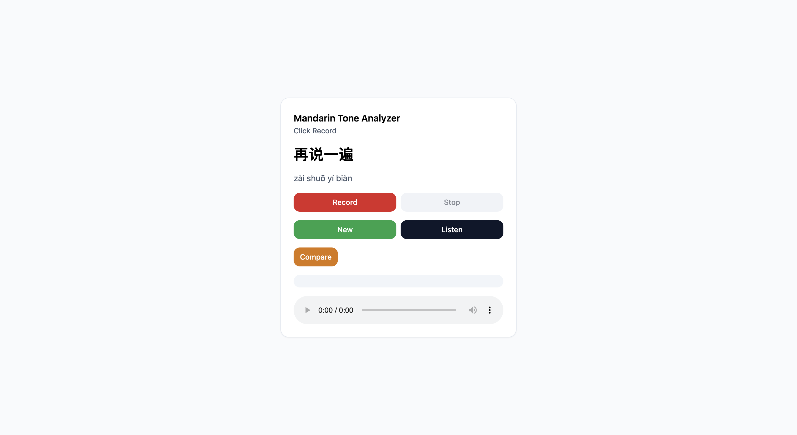
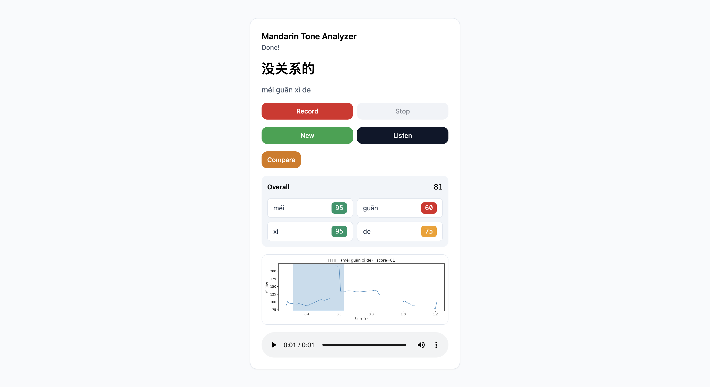

# Mandarin Tone Analyzer (Demo)

A bare-bones **full-stack** web app for Mandarin learners: pick a short phrase, **listen** to a reference pronunciation (server-side TTS), **record** your voice, then **compare** to get an **overall score**, **per-syllable scores**, and a **pitch (f0) plot** with problem regions highlighted.

This is a concept/demo project with minimal UX.

---

## 📸 Screenshots and Demo Video

Demo video: https://youtu.be/-Ele6t7fPr4

---

## 🧩 Features

- Random phrase selection (2–5 syllables)
- **Listen** button generates reference audio via **OpenAI TTS** (server-side)
- Browser recording (MediaRecorder) + upload to backend
- Compare pipeline:
  - converts audio to WAV (ffmpeg)
  - extracts pitch (f0) with Praat/Parselmouth
  - segments into syllable windows (simple demo segmentation)
  - returns overall score + per-syllable scores
  - produces a plot image with highlighted “bad” spans
- **SQLite + SQLAlchemy** persistence:
  - phrases table
  - attempts table (score, plot URL, syllable scores JSON, timestamp)

---

## 💻 Tech Stack

**Frontend**
- Jinja template (single page)
- Vanilla JS (fetch + DOM updates)
- Tailwind CSS (CDN)

**Backend**
- Flask (routes + API)
- SQLite + SQLAlchemy (data persistence)

**Audio / Analysis**
- MediaRecorder (browser)
- ffmpeg (normalization)
- Praat via Parselmouth (pitch extraction)
- Matplotlib (plots)

**Third-party API**
- OpenAI Text-to-Speech (server-side)

---

## 🗂️ Project Structure (typical)

- `mainapp/`
  - `templates/` (UI)
  - `static/`
  - `api/` (blueprints + endpoints)
  - `uploads/` (user recordings)
  - `artifacts/` (plots, converted wavs, tts cache)
  - `app.db` (SQLite DB)
- `docs/`

---

## 👨🏾‍💻 Setup Instructions (Run Locally)

### 1) System prerequisites

Install ffmpeg (macOS):

    brew install ffmpeg

### 2) Clone + virtual environment

    git clone https://github.com/GabrielSwai/Mandarin-Tone-Analyzer
    cd Mandarin-Tone-Analyzer

    python -m venv .venv
    source .venv/bin/activate

### 3) Install dependencies

    pip install -r requirements.txt

### 4) Set OpenAI API key (for server-side TTS)

    echo 'OPENAI_API_KEY="sk-..."' > .env

### 5) Run the app

    flask run

Then open:

    http://localhost:5000/

---

## How To Use

1. Click **New** to load a new phrase.
2. Click **Listen** to generate & play reference audio (OpenAI TTS).
3. Click **Record**, speak the phrase, click **Stop** to stop.
4. Click **Compare** to see:
   - overall score
   - per-syllable scores
   - pitch plot

---

## API Endpoints (high level)

- `GET /api/phrase`
  - returns `{ phrase_id, hanzi, pinyin }`

- `POST /api/tts`
  - body: `{ phrase_id }`
  - returns `{ tts_url }`

- `POST /api/upload`
  - multipart form: `audio` + `phrase_id`
  - returns `{ file_url, bytes_saved }`

- `POST /api/compare`
  - body: `{ phrase_id, file_url }`
  - returns `{ score, syllables, plot_url }`

---

## Data Persistence (SQLite)

The app uses SQLite for persistence (beyond filesystem storage).

**phrases**
- `phrase_id` (PK)
- `hanzi`
- `pinyin`

**attempts**
- `id` (PK)
- `phrase_id` (FK)
- `created_at`
- `file_url`
- `score`
- `syllables_json`
- `plot_url`

DB file:

- `mainapp/app.db`

---

# Learning Journey

## What inspired this project
Mandarin tone feedback for me has been vague and hard to quantify, but pitch is measurable and visualizable. I wanted a tool that turns practice into a tight loop: **listen → speak → measure → adjust**.

## Potential impact
Even as a demo, this shows how language learning can be made more "debuggable." With iteration, it could:
- help self-learners get concrete tone feedback without a tutor
- support classroom drills with consistent scoring
- reduce frustration by showing *what* changed in pitch, not just "wrong tone"

## New technology learned (and why)

- **SQLAlchemy + SQLite**: chosen for lightweight persistence without running a separate DB service.
- **Praat/Parselmouth**: chosen because Praat is a canonical tool for phonetics, and Parselmouth makes it usable from Python.
- **Server-side OpenAI TTS**: chosen to satisfy "third-party API called from backend" while generating consistent reference audio.

---

# Technical Rationale

## Why the backend/frontend are structured this way
- The frontend is intentionally thin: one page + JS to call endpoints and update the UI.
- The backend owns the heavy work:
  - keeping API keys private (OpenAI calls server-side)
  - running audio conversion + analysis
  - generating plots
  - writing results to SQLite

This separation keeps the browser simple and avoids exposing secrets or heavyweight DSP logic client-side.

## Biggest tradeoffs / choices
- **Simple syllable segmentation**: the demo uses uniform time windows rather than forced alignment. It’s not linguistically perfect, but it’s robust enough for a demo and easy to explain.
- **Pitch-only scoring**: ignores intensity, duration, segmental errors, etc. Tone practice mostly cares about f0 first, so this keeps scope manageable.
- **Filesystem artifacts + SQLite metadata**: files (audio/plots) are stored on disk for simplicity; SQLite stores the metadata for persistence.

## Hardest bug + how it was debugged
A major issue was Matplotlib crashing on macOS with an error like:

"Cannot create a GUI FigureManager outside the main thread..."

Cause: Matplotlib defaulted to a GUI backend on macOS, but Flask request handlers run in worker threads.  

Fix: forced a non-interactive backend (e.g., `Agg`) before importing `matplotlib.pyplot`, then restarted the server to ensure the backend actually changed.

Other debugging techniques used:
- printing/logging request payloads and returned URLs
- verifying file paths vs URL paths (uploads/artifacts)
- confirming ffmpeg availability and output file creation
- testing endpoints directly with curl/Postman before wiring UI

---

## AI Usage

I used AI tools (just ChatGPT) to accelerate implementation and debugging. Example prompt:

> "Give me drop-in SQLAlchemy code for SQLite persistence, plus a /compare endpoint that saves results."

The output needed adaptation:
- I refactored session handling to match my actual app initialization path.
- I fixed `get_session()` signature mismatches (`get_session(app)` vs global session factory).
- I patched Matplotlib backend issues specific to macOS + Flask threads.

The final code was not "copy-paste and done"; it required integrating with my file structure, blueprint names, and runtime environment.